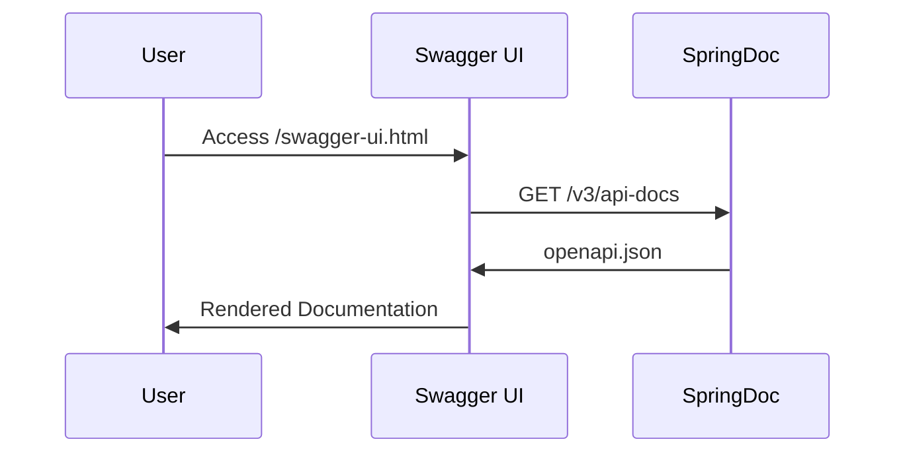

How do you upload multiple PDF file in reactive REST API?.<!-- truncate_here -->

How do you upload multiple PDF file in reactive REST API?

## Project Overview

- Spring Boot WebFlux (Reactive Web)
- SpringDoc OpenAPI 3 documentation
- Project Reactor
- Java 21

## Project Setup (`build.gradle`)


---
id: 2d7962ae629f4b5c8cc1ed4c45bb9846
file: build.gradle
---


### Key Dependencies

* **webflux:** Enables reactive web programming

* **springdoc-openapi:** Generates OpenAPI 3 documentation

* **reactor-test:** Provides testing utilities for reactive streams

## Main Application Class


---
id: 2d7962ae629f4b5c8cc1ed4c45bb9846
file: DemoUploadApplication.java
---


### Key Annotations:

* **@OpenAPIDefinition:** Enables Swagger/OpenAPI documentation

* Customizes API metadata through `@Info`

## Reactive File Upload Controller


---
id: 2d7962ae629f4b5c8cc1ed4c45bb9846
file: FileUploaderController.java
---


### Why FilePart instead of MultipartFile?

* **Reactive Paradigm:**
  - Flux handles streams of data asynchronously
  - Processes files as they arrive without buffering entire request

* **Memory Efficiency:**
  - Handles large files without memory overload
  - Backpressure-aware (controls data flow rate)

* **Non-Blocking I/O:**
  - Works with WebFlux's event-loop model
  - Maintains high concurrency with minimal threads

## Testing with Swagger UI

Access the API documentation at:


---
id: 2d7962ae629f4b5c8cc1ed4c45bb9846
file: Swagger.md
---


## Understanding Documentation Components

### OpenAPI Specification (openapi.json)

* Machine-readable API contract

* Generated at runtime via `/v3/api-docs` endpoint

* Contains endpoints, schemas, and examples

### Swagger UI (index.html)

* Human-friendly documentation interface

* Auto-generated from `openapi.json`

* Accessible via `/swagger-ui.html`

