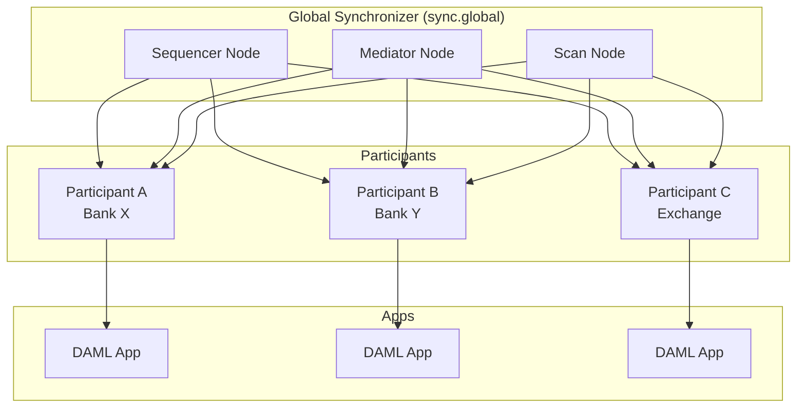

What if blockchains could talk to each other while keeping secrets? That's Canton.<!-- truncate_here -->

## What's Canton?

Canton is a **private permissioned blockchain** built by Digital Asset. But wait—what do those words actually mean?

**Private**: Unlike Bitcoin where anyone can see every transaction, Canton hides transaction details. Only parties involved in a deal see it. Your competitor won't know you just bought 10,000 widgets.

**Permissioned**: Bitcoin lets anyone run a node and mine blocks. Canton says "not so fast." You need approval to join. Only validated nodes can write to the ledger. Why? Because financial institutions don't want anonymous strangers validating their trades.

Canton isn't *one* blockchain. It's a **network of synchronized domains** that can interoperate. Think of domains as separate rooms where transactions happen—but parties can walk between rooms while maintaining consistency.

## How Do You Write Canton Apps?

You write smart contracts in **DAML** (Digital Asset Modeling Language). It looks like Haskell because it *is* based on Haskell—a functional language designed to avoid bugs through strong typing.


---
id: c1eda9f78bda146edc3835ff102dc7de
files:
  - file: example.hs
    language: daml
  - file: Example.java
    language: java
---


The key difference? In Java, authorization is just data you check at runtime. In DAML, it's enforced by the compiler and the ledger—you literally cannot submit a transaction where an unauthorized party exercises a choice.

What's happening here?

- **template**: A blueprint for contracts (like a class in OOP)
- **Party**: An identity on the ledger—could be a person, company, or system
- **signatory**: Who must authorize this contract's creation? The organizer. Without their signature, no contract.
- **observer**: Who can *see* this contract but didn't sign it? The buyer. They're watching.
- **choice**: An action that can transform or consume this contract. Here, `Accept` lets the buyer turn the offer into an agreement.
- **controller**: Who can trigger this choice? Only the buyer.

DAML's superpower: **authorization is built into the language**. You can't accidentally write code that lets unauthorized parties modify contracts. The compiler catches it.

### From Code to Ledger

```
DAML source → daml build → DAR file → Upload to Participant Node → Execute on Ledger
```

**DAR** (DAML Archive) is like a JAR file—compiled bytecode bundled with dependencies. The participant node's DAML engine interprets this bytecode when executing transactions.

## The Governance Layer

### Global Synchronizer Foundation (GSF)

Who runs this thing? Not Digital Asset alone. The **Global Synchronizer Foundation** is a non-profit that:

- Owns the **sync.global** domain (the main synchronization domain)
- Sets network rules and policies
- Manages the tokenomics committee that approves new validators
- Coordinates upgrades across the network

Think of GSF as the "board of directors" for Canton's shared infrastructure.

### Super Validators (SVs)

The heavy lifters. Large institutions like **digitalasset.com**, **cumberland.io**, and others run critical infrastructure:

| What They Run | What It Does |
|--------------|--------------|
| **Sequencer Nodes** | Order transactions globally. Without ordering, you get chaos—two parties could "double-spend." |
| **Mediator Nodes** | Coordinate transaction confirmations across participants |
| **Scan Nodes** | Provide APIs for querying the ledger history |

SVs have their own security policies and must meet strict uptime requirements. They're the backbone.

### Regular Validators

Smaller participants who validate transactions but don't run global infrastructure.

Requirements:
- Must be **sponsored by an SV** (no strangers allowed)
- Must get **IP allowlisted** by multiple SV operators (defense in depth)
- Follow network compliance rules

## Key Technical Concepts

### Contracts and Contract IDs

A **contract** is a live instance of a DAML template on the ledger. When you `create` in DAML, you get back a `ContractId`—a unique reference to that specific contract instance.

```haskell
contractId <- create MyTemplate with field1 = "value"
-- contractId is now a pointer to this contract
```

Contract IDs are **content-addressed**: derived from the contract's contents. Same inputs = same ID (but you can't create duplicates—the ledger prevents it).

Contracts have lifecycles:
1. **Active**: Created and available for use
2. **Archived**: Consumed by a choice—gone forever, but history remains

### Domains and Synchronization

A **domain** is a synchronization point where transactions get ordered and confirmed. Canton can have multiple domains:

- **sync.global**: The main domain run by GSF
- Private domains: Your company could run one internally

Transactions can span domains through **domain transfers**—moving a contract from one domain to another while maintaining atomicity.

### Migration ID

A **network-level concept** that tracks major protocol upgrades.

| Environment | Migration ID |
|-------------|--------------|
| Devnet | 1 |
| Testnet | varies |
| Mainnet | increments with protocol upgrades |

Why does this matter? When Canton upgrades its protocol, the migration ID increments. Your application database tracks which migration it's synced to.

## Troubleshooting

### Recovering from a Failed Upgrade

When a Canton node upgrade fails mid-way, your database might be in an inconsistent state. Check what was actually ingested:


---
id: c1eda9f78bda146edc3835ff102dc7de
file: checkError.sql
---


**No rows returned?** Good news—nothing was ingested, database is clean. Roll back the binary and retry.

**Rows returned?** The upgrade partially completed. You'll need to either:
1. Complete the upgrade manually
2. Restore from backup and retry

### Common Gotchas

**"Party not authorized"**: Your DAML choice's controller doesn't match who's submitting the command. Check your `controller` clauses.

**"Contract not found"**: Either the contract was archived, or your party can't see it (not a signatory or observer).

**"Domain disconnected"**: Your participant lost connection to the synchronization domain. Check network, check sequencer health.

## Architecture at a Glance



Each participant runs their own node, stores their own view of contracts they're party to, and submits transactions through the synchronizer.

