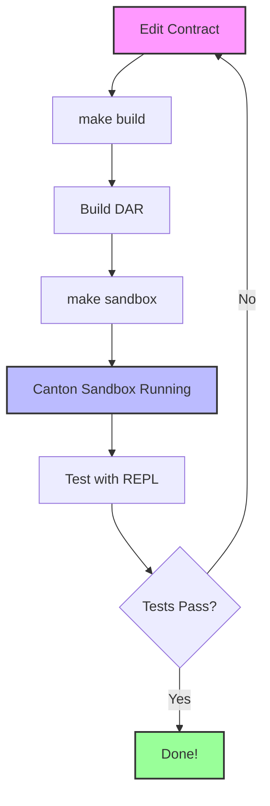
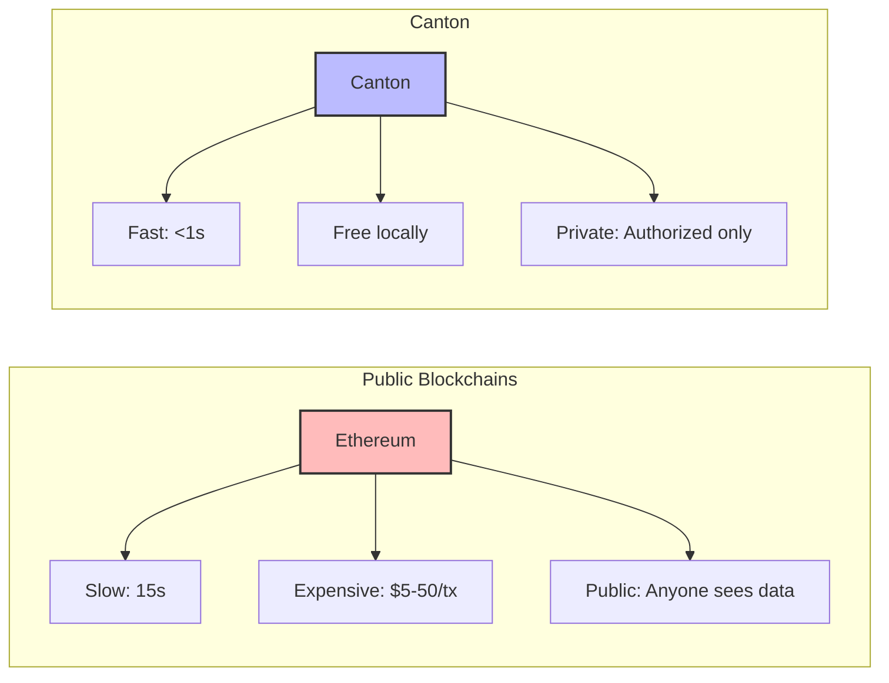
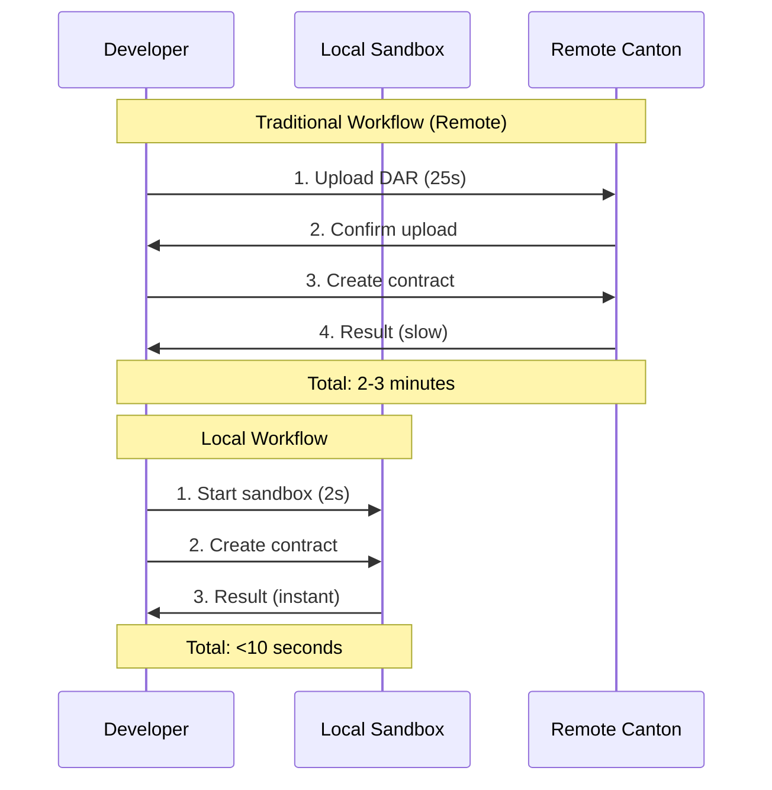

Testing blockchain contracts in production is expensive. Deploying to remote Canton environments is slow. I needed a way to build, deploy, and test smart contracts locally. Enter: Canton Sandbox + Makefile automation.<!-- truncate_here -->

Testing blockchain contracts in production is expensive. Deploying to remote Canton environments is slow. I needed a way to build, deploy, and test smart contracts locally. Enter: Canton Sandbox + Makefile automation.

## The Problem with Remote Testing

**Scenario**: You need to test a smart contract change.

**Traditional workflow without local setup**:

```bash
# Step 1: Edit your DAML contract
cat > src/daml/MyContract.daml <<'EOF'
module MyContract where

template Asset
  with
    owner : Party
    name : Text
    value : Decimal
  where
    signatory owner
EOF

# Step 2: Build the package
daml build
# Compiling mypackage to a DAR.
# Created .daml/dist/mypackage-1.0.0.dar (8 seconds)

# Step 3: Upload to remote Canton
daml ledger upload-dar \
  --host=remote-canton.example.com \
  --port=6865 \
  .daml/dist/mypackage-1.0.0.dar

# Uploading DAR to remote-canton.example.com...
# Package uploaded: 8f3d2a1b9c7e... (25 seconds)

# Step 4: Test the contract
daml repl --ledger-host=remote-canton.example.com --ledger-port=6865

# import MyContract
# owner <- allocateParty "Alice"
# Error: Connection timeout!
# (VPN issue? Firewall? Who knows...)

# Step 5: Fix the issue, repeat the entire cycle...
# Total time: ~2-3 minutes per iteration
```

**Real-world pain points**:

1. **Network dependency**:
   ```bash
   daml ledger upload-dar --host=remote-canton...
   # Error: Connection refused (VPN down)
   # (Can't test anything now)
   ```

2. **Slow feedback loop**:
   ```bash
   # Edit → Build → Upload → Test = 2-3 minutes
   # Found a typo? Repeat the cycle.
   ```

3. **Cost and permanence**:
   ```bash
   # Each contract creation on remote blockchain:
   # - Costs money (transaction fees)
   # - Creates permanent records (can't delete test data)
   # - Requires cleanup scripts
   ```

**Issues summary**:
1. **Slow feedback loop**: Build → Upload → Test takes 2-3 minutes
2. **No local testing**: Can't test without network access
3. **Expensive**: Blockchain writes cost money (even in dev environments)
4. **Test data pollution**: Permanent test records clutter the ledger
5. **Team coordination**: Shared dev environment = conflicts

## Why Canton + Local Sandbox?

**Canton** is enterprise blockchain built by Digital Asset. Unlike public blockchains:
- **Private**: Only authorized parties see contracts
- **Fast**: Sub-second finality
- **Free locally**: Test without transaction fees
- **Offline**: No network required for local testing

**The solution**: Run Canton Sandbox locally.

**Same scenario with local setup**:

```bash
# Step 1: Edit the contract (same as before)
cat > src/daml/MyContract.daml <<'EOF'
module MyContract where

template Asset
  with
    owner : Party
    name : Text
    value : Decimal
  where
    signatory owner
EOF

# Step 2: Build
daml build
# Compiling mypackage to a DAR.
# Created .daml/dist/mypackage-1.0.0.dar (8 seconds)

# Step 3: Start local Canton Sandbox (first terminal)
daml sandbox --port 6865 \
  --dar .daml/dist/mypackage-1.0.0.dar

# Starting Canton Sandbox...
# Ledger API: localhost:6865
# Sandbox is ready. (2 seconds)

# Step 4: Test immediately (second terminal)
daml repl --ledger-host=localhost --ledger-port=6865

# import MyContract
# alice <- allocateParty "Alice"
# submit alice $ createCmd Asset with
#   owner = alice
#   name = "House"
#   value = 250000.0
#
# Success! Contract created. (instant)

# Step 5: Found a bug? Fix and rebuild
# Ctrl+C on sandbox
daml build && daml sandbox --port 6865 --dar .daml/dist/mypackage-1.0.0.dar
# (10 seconds total - back to testing)

# Total iteration time: <15 seconds
```

**Comparison**:

| Task | Remote Canton | Local Sandbox |
|------|---------------|---------------|
| Build time | 8 seconds | 8 seconds |
| Upload time | 25 seconds | 0 seconds |
| Network required | Yes (VPN, firewall) | No |
| Test data | Permanent (costs money) | Deleted on restart (free) |
| Iteration time | 2-3 minutes | <15 seconds |
| Offline testing | ❌ No | ✅ Yes |

**Benefits**:
- **Fast**: Test in <15 seconds (vs 2-3 minutes)
- **Free**: No blockchain costs
- **Offline**: No network, VPN, or remote access needed
- **Clean**: Stop sandbox = fresh start
- **Isolated**: Each developer has their own ledger

## Setup: Install DAML SDK

```bash
# Install DAML SDK (latest version)
curl -sSL https://get.daml.com/ | sh

# Restart your terminal, then verify
daml version
# Output: SDK versions:
#   3.4.10 (or later)
```

## Create Your First Project

Let's create a simple asset tracking smart contract from scratch.

### Step 1: Initialize Project

```bash
# Create a new DAML project
mkdir my-daml-project && cd my-daml-project
daml new . --template skeleton

# Project structure created:
# my-daml-project/
# ├── daml.yaml         # Project configuration
# └── daml/
#     └── Main.daml     # Smart contract code
```

### Step 2: Write a Simple Contract

Edit `daml/Main.daml`:

```haskell
module Main where

-- Simple asset template
template Asset
  with
    owner : Party
    name : Text
    value : Decimal
  where
    signatory owner

    -- Allow owner to transfer asset to someone else
    choice Transfer : ContractId Asset
      with
        newOwner : Party
      controller owner
      do
        create this with owner = newOwner
```

**What this does**:
- **Template Asset**: Defines an asset with owner, name, and value
- **signatory owner**: Only the owner can create this contract
- **choice Transfer**: Allows owner to transfer asset to a new owner

### Step 3: Build the Contract

```bash
# Build the project
daml build

# Output:
# Compiling my-daml-project to a DAR.
# Created .daml/dist/my-daml-project-0.0.1.dar
```

## Running Locally with Canton Sandbox

### Start the Sandbox

```bash
# Start Canton Sandbox with your contract
daml sandbox --port 6865 --dar .daml/dist/my-daml-project-0.0.1.dar

# Output:
# Starting Canton Sandbox...
# Ledger API (gRPC): localhost:6865
# Sandbox ready.
```

### Test Your Contract

Open a new terminal:

```bash
# Connect to the running sandbox
daml repl --ledger-host=localhost --ledger-port=6865

# In the REPL, test your contract:
```

```haskell
-- Import your module
import Main

-- Create parties
alice <- allocateParty "Alice"
bob <- allocateParty "Bob"

-- Alice creates an asset
assetId <- submit alice $ createCmd Asset with
  owner = alice
  name = "Tesla Model 3"
  value = 35000.0

-- Query Alice's assets
query @Asset alice
-- Output: [Asset { owner = Alice, name = "Tesla Model 3", value = 35000.0 }]

-- Alice transfers the asset to Bob
newAssetId <- submit alice $ exerciseCmd assetId Transfer with
  newOwner = bob

-- Verify Bob owns it now
query @Asset bob
-- Output: [Asset { owner = Bob, name = "Tesla Model 3", value = 35000.0 }]

-- Alice no longer has it
query @Asset alice
-- Output: []
```

## Automating with Makefile

For larger projects, automate the workflow:

Create `Makefile`:

```makefile
.PHONY: build
build:
	@echo "Building DAML project..."
	@daml build
	@echo "✅ Build complete!"

.PHONY: sandbox
sandbox:
	@if [ ! -f ".daml/dist/*.dar" ]; then \
		echo "❌ No DAR found. Run 'make build' first."; \
		exit 1; \
	fi
	@echo "Starting Canton Sandbox..."
	@echo "Ledger API: localhost:6865"
	@daml sandbox --port 6865 --dar .daml/dist/*.dar

.PHONY: test
test:
	@echo "Running DAML tests..."
	@daml test

.PHONY: clean
clean:
	@echo "Cleaning build artifacts..."
	@rm -rf .daml/dist
	@echo "✅ Clean complete!"

.PHONY: help
help:
	@echo "DAML Project Commands:"
	@echo "  make build    - Build the DAR file"
	@echo "  make sandbox  - Start Canton Sandbox"
	@echo "  make test     - Run DAML tests"
	@echo "  make clean    - Remove build artifacts"
```

**Usage**:

```bash
# Build
make build

# Start sandbox (keep this terminal open)
make sandbox

# In another terminal, connect with REPL
daml repl --ledger-host=localhost --ledger-port=6865
```

## Visualizing the Workflow

Here's how the local development workflow looks:



## Advanced: Testing with Scripts

Create `test-asset.daml` for automated testing:

```haskell
module TestAsset where

import DA.Assert
import Main

-- Test: Create and transfer asset
testAssetTransfer = scenario do
  alice <- allocateParty "Alice"
  bob <- allocateParty "Bob"
  
  -- Alice creates an asset
  assetId <- submit alice $ createCmd Asset with
    owner = alice
    name = "Test Asset"
    value = 1000.0
  
  -- Transfer to Bob
  newAssetId <- submit alice $ exerciseCmd assetId Transfer with
    newOwner = bob
  
  -- Verify Bob owns it
  Some asset <- queryContractId bob newAssetId
  asset.owner === bob
  asset.name === "Test Asset"
```

Run tests:

```bash
# Run all tests
daml test

# Output:
# Test: testAssetTransfer ... PASSED
# All tests passed!
```

## How Canton Differs from Public Blockchains



**Key differences**:

| Feature | Ethereum/Public | Canton |
|---------|----------------|--------|
| **Finality** | 15+ seconds | Sub-second |
| **Cost** | $5-50 per transaction | Free (local), low cost (prod) |
| **Privacy** | Everyone sees data | Only authorized parties |
| **Local testing** | Complex (Ganache, etc.) | Simple (daml sandbox) |
| **Use case** | DeFi, NFTs | Enterprise apps |

## Real-World Use Cases

**Where Canton shines**:

1. **Financial Services**:
   - Multi-party trade settlements
   - Supply chain finance
   - Securities lending

2. **Supply Chain**:
   - Goods tracking across companies
   - Invoice factoring
   - Compliance auditing

3. **Healthcare**:
   - Patient data sharing (HIPAA compliant)
   - Clinical trial coordination
   - Insurance claims

**Why local testing matters**:
- **Regulatory compliance**: Test data privacy rules without exposing real data
- **Cost**: No blockchain fees during development
- **Speed**: Instant feedback loop

## Troubleshooting

### Error: "daml: command not found"

**Solution**: DAML SDK not in PATH. Restart terminal after installation:

```bash
# Reinstall if needed
curl -sSL https://get.daml.com/ | sh

# Restart terminal
exit
# (Open new terminal)

daml version
```

### Error: "Port 6865 already in use"

**Solution**: Another sandbox is running:

```bash
# Find and kill the process
lsof -ti:6865 | xargs kill -9

# Start sandbox again
make sandbox
```

### Error: "Package not found"

**Solution**: Build first:

```bash
make build
make sandbox
```

## Comparing Development Workflows



## Next Steps

### 1. Add More Templates

Extend your contract with new templates:

```haskell
-- Add a Marketplace template
template Marketplace
  with
    operator : Party
    assets : [ContractId Asset]
  where
    signatory operator
```

### 2. Implement Choices

Add business logic with choices:

```haskell
-- Add an Auction choice
choice PlaceBid : ContractId Asset
  with
    bidder : Party
    amount : Decimal
  controller bidder
  do
    -- Auction logic here
    create this
```

### 3. Deploy to Production

Once tested locally, deploy to a real Canton network:

```bash
# Upload to production Canton
daml ledger upload-dar \
  --host=production-canton.example.com \
  --port=6865 \
  .daml/dist/my-daml-project-0.0.1.dar
```

### 4. Build a UI

Create a React/Angular app that connects to Canton:

```typescript
// Example: Query assets via JSON API
fetch('http://localhost:7575/v2/query', {
  method: 'POST',
  headers: { 'Content-Type': 'application/json' },
  body: JSON.stringify({
    templateId: 'Main:Asset',
    query: { owner: 'Alice::122...' }
  })
})
```

## Summary

**Before local setup**:
- Edit → Build → Upload → Test = 2-3 minutes
- Need network access
- Costs money
- Test data pollutes ledger

**After local setup**:
- Edit → Build → Test = <15 seconds
- Works offline
- Free
- Clean slate every restart

**Key commands**:
```bash
make build    # Build DAR
make sandbox  # Start Canton
make test     # Run tests
make clean    # Clean up
```

**What you learned**:
- ✅ Set up DAML SDK and Canton Sandbox
- ✅ Create smart contracts with templates and choices
- ✅ Test locally without network or costs
- ✅ Automate with Makefile
- ✅ Debug and iterate quickly

**Further reading**:
- [DAML Documentation](https://docs.daml.com/)
- [Canton Documentation](https://docs.daml.com/canton/index.html)
- [DAML Examples](https://github.com/digital-asset/daml)

Try it yourself. Create a project, write a contract, and test it locally. You'll be iterating on blockchain contracts as fast as regular code.