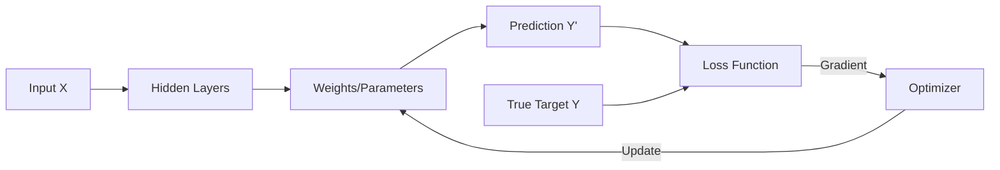
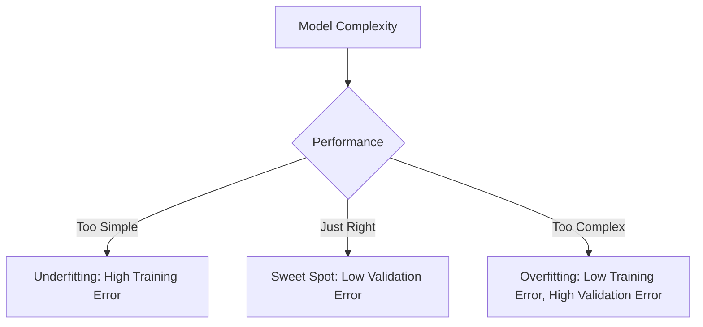
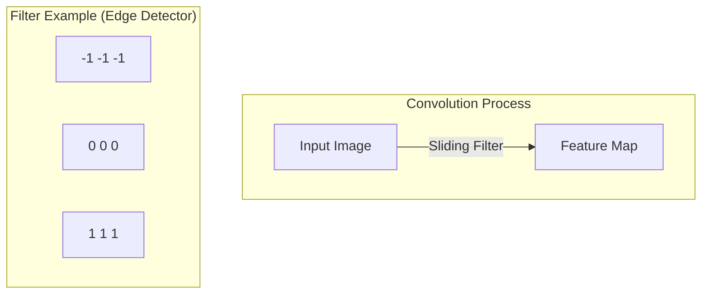

Dear Vishi, dear logs for today.<!-- truncate_here -->

Dear Vishi, dear logs for today.

## Deep Learning Lectures

Today I dove deeper into the fundamentals of Deep Learning and explored how Convolutional Neural Networks (CNNs) actually "see" images.

### What is a Weight?
A weight in a model is a **trainable parameter** (a coefficient). We multiply the input features by these weights (and add a bias) to produce a prediction. The goal of training is to adjust these weights to minimize the **Loss Function**, which measures the error between our prediction and the actual target.

### Mental Model of Training
The training process is a feedback loop where we use the gradient of the loss to update our parameters.

### Optimization: Gradient Descent
The most common optimization algorithm is **Gradient Descent**. The weights are updated by moving in the opposite direction of the gradient:

$$w \leftarrow w - \alpha \cdot \frac{\partial Loss}{\partial w}$$

- **Batch Gradient Descent:** One pass through the entire dataset (one epoch) before updating.
- **Stochastic Gradient Descent (SGD):** Updates weights after seeing a small "mini-batch" of data. This is much faster and helps the model escape local minima.

### Overfitting vs. Underfitting
Finding the "sweet spot" in model complexity is crucial for generalization.

- **Underfitting:** The model hasn't learned the patterns in the training data yet.
- **Overfitting:** The model "memorizes" the training data too well, making it fail on new, unknown data.

### Tensors: The Building Blocks
Tensors are N-dimensional arrays that flow through the network:
- **Rank 0:** Scalar (a single number like `23`)
- **Rank 1:** Vector (a list of numbers)
- **Rank 2:** Matrix (a 2D grid/table)
- **Rank N:** N-dimensional array (e.g., a batch of color images)

---

## Deep Learning for Computer Vision (CNNs)

I watched the [MIT 15.773 lecture](https://www.youtube.com/watch?v=8QuyDcMIdRc&t=1870s) by Rama Ramakrishnan. The key takeaway was understanding the **Convolution Operation**.

### The Sliding Filter (Kernel)
Unlike regular neural networks where every input is connected to every neuron, CNNs use a small window called a **Filter** or **Kernel** (e.g., 3x3).

This filter "slides" across the image, performing a mathematical operation (dot product) at each step to create a **Feature Map**.

### Stride and Padding
- **Stride:** How many pixels the filter moves at each step. A larger stride reduces the output resolution.
- **Padding:** Adding "dummy" pixels (usually zeros) around the edges so the filter can process the border pixels without shrinking the image too much.

### The Feature Hierarchy
CNNs detect features hierarchically, similar to how the human brain processes vision:
1. **Early Layers:** Detect simple lines and edges.
2. **Middle Layers:** Combine edges into shapes (circles, corners).
3. **Deep Layers:** Combine shapes into complex objects (faces, cars, trees).

This **Spatial Invariance** (detecting a feature no matter where it is in the image) is why CNNs revolutionized computer vision.
