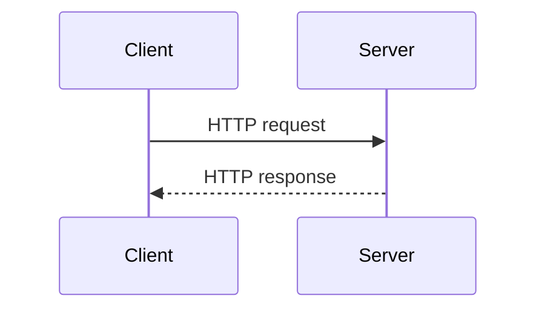
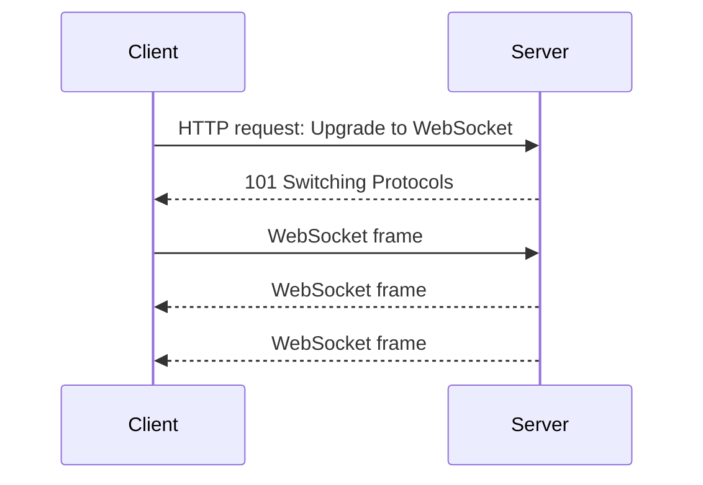
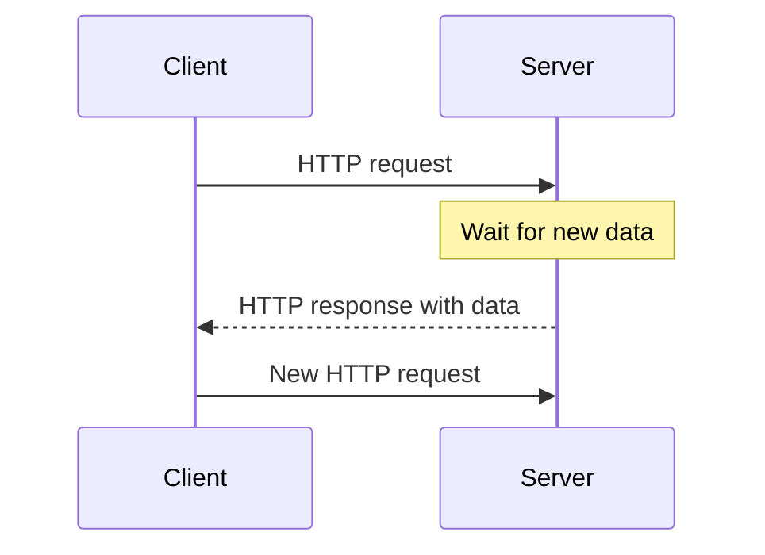

HTTP follows a request-response model: a client sends a request, and the server returns a response. This works well for most web applications, but what if the server needs to send data as soon as it becomes available?<!-- truncate_here -->


> Caption Image -  Machu Pichu


HTTP follows a request-response model: a client sends a request, and the server returns a response. This works well for most web applications, but what if the server needs to send data as soon as it becomes available?11

WebSockets, Server-Sent Events, and long polling are three common ways to handle real-time communication.

## HTTP request and response

HTTP is stateless. Each request is independent, and the server sends a response only after the client sends a request.



Repeatedly sending HTTP requests to check for new data works, but it adds latency and unnecessary overhead.

## WebSockets

A WebSocket creates a persistent, full-duplex connection. After the connection is established, the client and server can send messages to each other at any time.

The connection begins as an HTTP request containing upgrade headers:

```http
GET /chat HTTP/1.1
Host: example.com
Upgrade: websocket
Connection: Upgrade
Sec-WebSocket-Key: <key>
Sec-WebSocket-Version: 13
```

If the server accepts the upgrade, it responds with status `101 Switching Protocols`:

```http
HTTP/1.1 101 Switching Protocols
Upgrade: websocket
Connection: Upgrade
Sec-WebSocket-Accept: <value>
```



From that point onward, the connection no longer exchanges ordinary HTTP requests and responses. It exchanges compact WebSocket frames instead. This reduces per-message overhead, especially when many small messages are sent.

WebSocket URLs use:

- `ws://` for an unencrypted connection
- `wss://` for a connection secured with TLS

For example:

```text
wss://example.com/chat
```

WebSockets are a good fit for chat applications, multiplayer games, collaborative editing, and other features where both sides need to send updates immediately.

## Server-Sent Events

Server-Sent Events, or SSE, create a long-lived HTTP connection for communication in one direction: from the server to the client.

The client sends a normal HTTP request, and the server keeps the response open. The response uses the `text/event-stream` content type and sends events as they become available:

```http
HTTP/1.1 200 OK
Content-Type: text/event-stream

data: first update

data: second update
```

SSE is useful when the client only needs to receive updates. Streaming text from an AI model is a common example. If the client also needs to send data, it does so through separate HTTP requests.

## Long polling

With long polling, the client sends an HTTP request and the server holds it open until new data is available or a timeout occurs. The server then returns a normal HTTP response.

After receiving the response, the client immediately sends another request and waits again.



Long polling works with ordinary HTTP infrastructure, but every update eventually requires a new request and response. It is generally less efficient than WebSockets or SSE for frequent updates.

## Which one should you use?

| Approach | Direction | Connection | Best suited for |
|---|---|---|---|
| Regular HTTP | Client to server, then response | Short-lived | APIs and standard web requests |
| WebSocket | Both directions | Persistent | Chat, games, and live collaboration |
| SSE | Server to client | Persistent HTTP response | Notifications and streamed output |
| Long polling | Server responds when data is ready | Repeated HTTP requests | Compatibility with simpler HTTP systems |

Use WebSockets when communication must flow freely in both directions. Use SSE when the server mainly streams updates to the client. Use long polling when persistent streaming connections are not practical.
